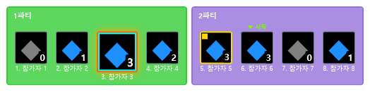
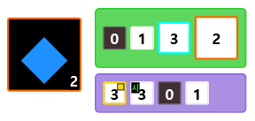
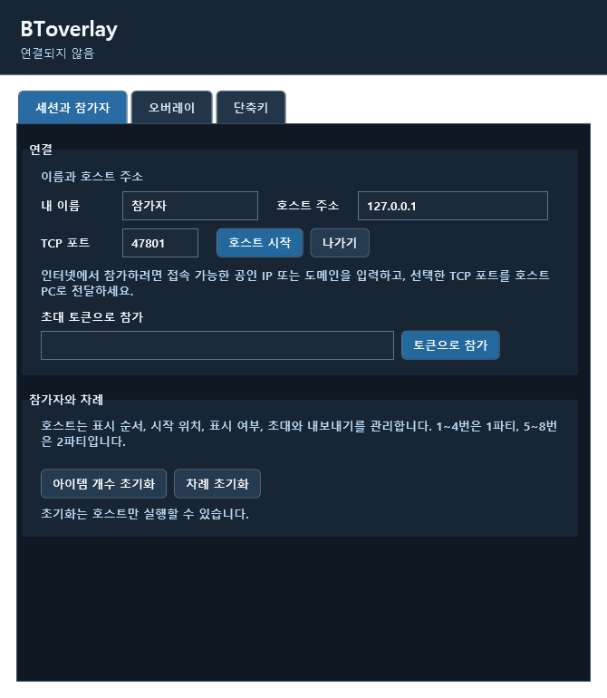
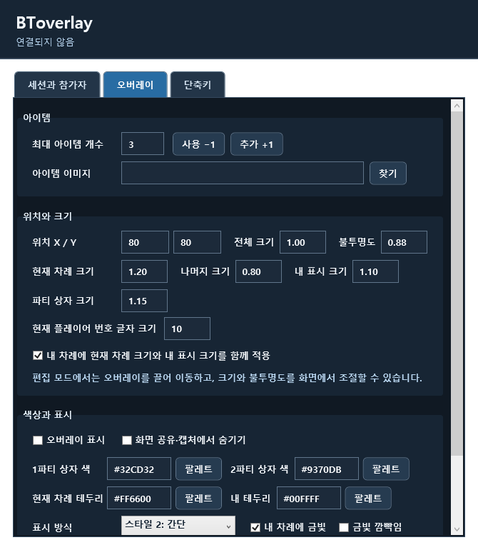
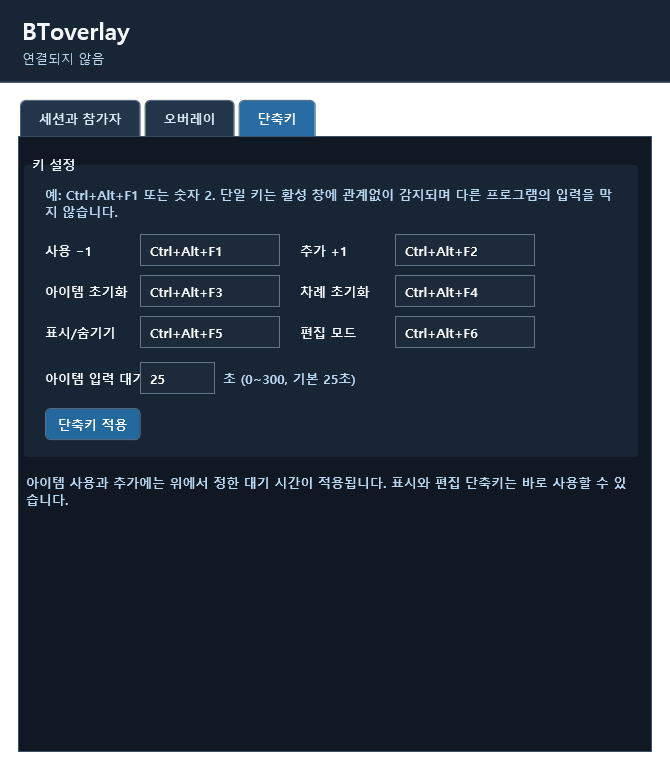

# BToverlay

8인 그룹의 아이템 잔여 개수와 사용 차례를 함께 보는 Windows 오버레이입니다. 호스트 1명과 참가자 최대 7명이 직접 연결합니다. 세션과 설정은 각 사용자에게 별도로 관리됩니다.

현재 버전: **v0.3.3**

## 화면 미리보기

오버레이는 두 가지 표시 방식을 지원합니다. 스타일 1은 두 파티를 나란히 표시하고, 스타일 2는 현재 차례 플레이어를 크게 보여 주면서 전체 인원 상태를 한눈에 확인할 수 있습니다. 호스트가 정한 순서가 모든 참가자에게 동일하게 표시됩니다.

### 스타일 1 · 파티별 보기



### 스타일 2 · 현재 플레이어 강조



### 설정 화면

각 플레이어는 세션 참가, 오버레이 표시와 크기, 색상 및 단축키를 자신의 앱에서 설정할 수 있습니다. 아이템 입력 대기 시간은 기본 25초이며 0~300초로 조정할 수 있습니다.

**세션과 참가자** — 초대 토큰으로 참가하고 플레이어 순서와 차례를 관리합니다.



**오버레이** — 아이템 이미지와 개수, 크기, 위치, 투명도, 색상, 표시 방식을 설정합니다.



**단축키** — 각 기능의 키와 아이템 입력 대기 시간을 지정합니다.




## 실행과 빌드

이 Git 저장소에는 빌드 결과를 포함하지 않습니다. Windows와 .NET 10 SDK에서 아래 명령으로 Windows x64 단일 실행 파일을 만드세요.

```powershell
dotnet publish BToverlay.csproj -c Release -r win-x64 --self-contained true -o dist
```

완성된 `dist/BToverlay.exe`를 실행하세요. .NET을 별도로 설치할 필요가 없습니다. 배포 폴더에는 실행 파일과 이 README가 들어 있습니다. 설정과 가져온 이미지는 실행 파일 옆의 `Data/`에 저장되므로 쓰기 가능한 폴더에 두세요. 실행 시 .NET의 네이티브 구성 요소가 Windows 임시 폴더에 자동으로 풀립니다.

소스에서 실행하려면 Windows와 .NET 10 SDK가 필요합니다.

```powershell
dotnet run --project BToverlay.csproj
```

로컬 통신 검증:

```powershell
dotnet run --project Checks/BToverlay.Checks.csproj
```

## 세션 만들기

1. 호스트는 **호스트만 연결 설정(내 IP 주소 구글 검색)**을 열어 게스트가 연결할 공인 IP 또는 도메인과 TCP 포트를 입력하고 **호스트 시작**을 누릅니다. 인터넷에서 사용하려면 공유기에서 해당 포트를 호스트 PC로 전달하고 방화벽에서 허용해야 합니다. 호스트 시작 후 주소 입력란은 접힙니다.
2. 호스트가 참가자 2~8번 자리마다 **초대 복사**를 눌러 각자에게 토큰을 개인적으로 보냅니다. 토큰은 해당 자리에서 한 번만 사용할 수 있습니다. 같은 자리의 새 토큰을 만들면 기존 토큰은 무효가 됩니다.
3. 참가자는 자신의 이름과 토큰만 입력하고 **토큰으로 참가**를 누릅니다. 호스트 주소와 포트는 토큰에서 읽으므로 직접 입력할 필요가 없습니다. 호스트에게 승인 요청이 뜨며, 호스트가 거절하면 해당 토큰은 무효가 됩니다.
4. 호스트는 표시 순서와 시작 위치를 정하고, 참가자를 오버레이에서 표시하거나 제외하고, 내보낼 수 있습니다. 내보낸 참가자가 다시 들어오려면 새 토큰과 호스트 승인이 필요합니다.

## 오버레이와 단축키

호스트가 정한 표시 순서는 호스트와 모든 참가자에게 동일하게 적용됩니다. 표시 순서 1~4는 1파티, 5~8은 2파티입니다. **스타일 1**은 각 참가자의 아이템 아이콘과 개수를 가로로 보여 줍니다. **스타일 2**는 왼쪽에 현재 차례 참가자의 아이콘·잔여 개수·파티 내 순번(예: `1-4`)을 크게 보여 주고, 오른쪽에 8명의 상태 칸을 배치합니다. 어두운 상태 칸은 잔여 개수 0, 현재 차례의 테두리는 선택한 현재 차례 색을 뜻합니다.

각 사용자는 파티 상자 두 개의 색, 현재 차례 테두리 색, 내 테두리 색, 위치, 크기, 불투명도, 아이템 이미지, 금빛 효과와 깜빡임, 화면 공유·캡처에서 숨기기를 자신의 앱에서 따로 설정합니다. 스타일 2 왼쪽에 표시되는 현재 플레이어 번호(예: `1-4`)의 글자 크기도 오버레이 설정에서 조절할 수 있습니다. 색상은 `#32CD32` 같은 값으로 입력합니다. 현재 차례의 아이콘(스타일 2에서는 상태 칸) 확대는 기본으로 켜져 있으며 끌 수 있습니다. 이미지 파일은 각자의 `Data/items/`에 복사되고 다른 참가자에게 전송되지 않습니다.

색상 코드 옆 **팔레트** 버튼으로 미리 정한 색을 고르거나 원하는 색상 코드를 입력할 수 있습니다. 색을 선택하면 즉시 오버레이에 적용되고 저장됩니다.

**편집 모드** 버튼이나 단축키(기본 `Ctrl+Alt+F6`)로 오버레이를 직접 조절할 수 있습니다. 오버레이를 끌어서 이동하고 오른쪽 아래 손잡이로 전체 크기를 바꿉니다. 편집 막대에서 전체·현재 차례·나머지·내 표시·파티 상자의 크기를 각각 조절하고 불투명도 슬라이더를 사용할 수 있습니다. 기본값은 내 차례에 현재 차례 크기를 적용합니다. **함께 적용** 옵션을 켜면 현재 차례 크기와 내 표시 크기를 곱해서 적용합니다. 편집 모드가 끝나면 설정이 저장됩니다.

현재 차례인 사람이 아이템 개수를 0으로 만들면 호스트가 정한 표시 순서에서 아이템이 남아 있고 표시 중인 다음 사람에게 차례가 넘어갑니다. 아이템이 0개이거나 표시에서 제외된 사람은 건너뜁니다. 자신의 차례가 아니어도 **사용 −1** 단축키로 개수를 줄일 수 있습니다. 이때 모든 참가자의 오버레이에 해당 사람의 작은 금색 표시가 5초 동안 나타나고, 현재 차례는 바뀌지 않습니다. **추가 +1**도 모든 참가자에게 공유됩니다. 개수는 0~10 범위에서만 바뀝니다.

**아이템 개수 초기화**는 각자가 자신의 앱에서 정한 최대 개수(기본 3)로 되돌리되 차례는 유지합니다. **차례 초기화**는 아이템 개수를 건드리지 않고 호스트가 지정한 시작 위치로 돌아갑니다. 세션 초기화는 호스트만 할 수 있습니다.

단축키에는 `Ctrl+Alt+F1` 같은 조합이나 `2` 같은 단일 키를 입력할 수 있습니다. 단일 키는 활성 창에 관계없이 감지하고 해당 창의 키 입력을 막지 않습니다. 따라서 다른 프로그램에서 `2`를 입력해도 지정한 동작이 실행됩니다. 단축키를 길게 누르고 있어도 한 번만 실행됩니다. 수정키 조합은 Windows 전역 단축키로 등록합니다.

아이템 **사용 −1**과 **추가 +1**은 버튼과 단축키 모두 한 번 실행한 뒤 설정한 시간 동안 다시 실행할 수 없습니다. **아이템 입력 대기**에서 0~300초로 지정하며 기본값은 25초입니다. 0초는 대기 시간을 끕니다. 표시/숨기기, 편집 모드, 초기화 단축키에는 이 대기 시간이 적용되지 않습니다.

## 연결과 보안

참가자는 호스트에게 TLS로 직접 연결합니다. **호스트 IP 주소는 참가자용 앱 화면에 표시되지 않습니다.** 다만 직접 연결이므로 네트워크 트래픽을 분석하면 호스트 IP를 알아낼 수 있습니다. 초대 토큰에는 호스트 주소와 포트, 임의의 256비트 비밀값, 참가자 자리, 호스트의 임시 인증서 해시가 Base64 인코딩되어 있습니다. Base64는 암호화가 아니므로 토큰을 분석해도 호스트 주소를 확인할 수 있습니다. 참가자는 인증서가 토큰의 해시와 일치하는지 확인하고 토큰의 비밀값을 증명한 뒤 호스트 승인을 받습니다. 각 참가자는 자신의 자리 개수만 보낼 수 있으며 호스트는 0~10의 정수만 받습니다. 호스트가 세션의 상태를 참가자들에게 전달합니다. 다른 호스트와 토큰으로 시작한 세션은 서로 독립적입니다.

직접 연결이므로 호스트와 게스트는 네트워크 연결 과정에서 서로의 IP 주소를 알 수 있습니다. 호스트 앱은 게스트 IP를 연결 시도 제한을 위해 메모리에 보관하지만 화면에 표시하거나 디스크에 저장하지 않습니다.

앱은 참가 승인에 필요한 이름과 표시 순서·차례·초기화 같은 제어 정보도 전송합니다. 아이템 이미지, 게임 파일, 게임 메모리는 전송하거나 읽지 않습니다. 정상 참가자가 실제 아이템 사용과 다른 개수를 입력하는 것은 앱이 검증할 수 없습니다. 초대 토큰은 비공개로 전달하고 사용이 끝나면 세션을 닫으세요.

화면 공유에서 숨기기는 Windows와 사용하는 캡처 방식에 따라 결과가 달라질 수 있습니다. Windows가 숨기기 요청을 거절하면 설정 화면에 알립니다. 실제 공유 방식으로 확인하세요.
